# iOS-9-Sampler

Code examples for the new features of iOS 9.

##How to build

JUST BUILD with **Xcode 7**.

##Contents

###Map Customizations

**Flyover** can be selected with new map types, and **Traffic**, Scale and Compass can be shown.

<!--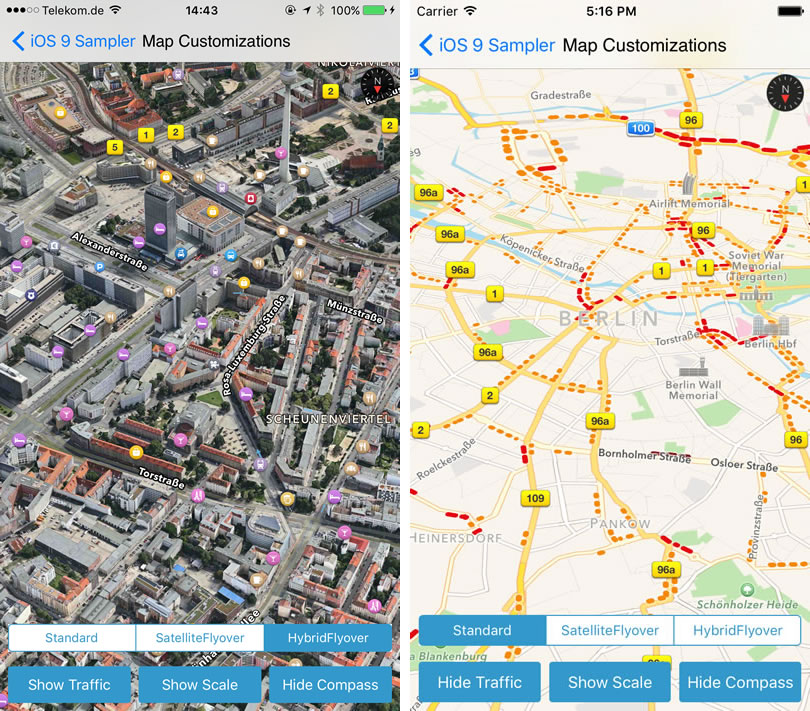-->

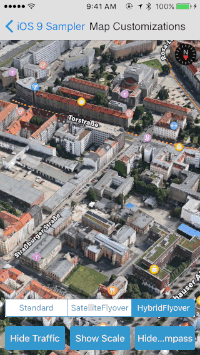

###Text Detector

Text detection using new detector type "CIDetectorTypeText".

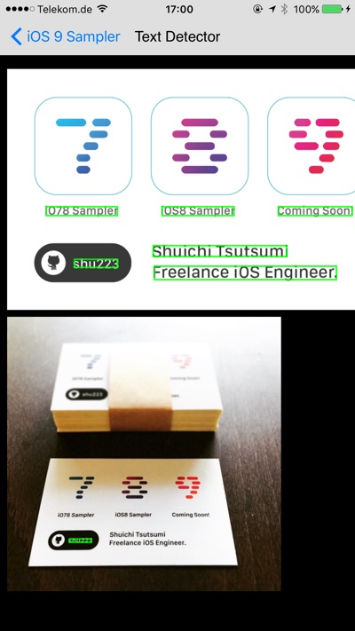

###New Image Filters

New filters of CIFilter which can be used for Still Images.

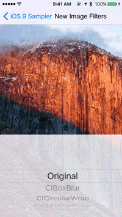

**NOTE:** 29 filters are supported in this example, however **"CISpotLight" don't work correctly** with current code. I would much appreciated your pull request!

###Audio Unit Component Manager

Retrieve audio unit components using AudioUnitComponentManager and apply them to a sound using some new methods. If there are some Audio Unit Extensions, they will be also shown in the components list.

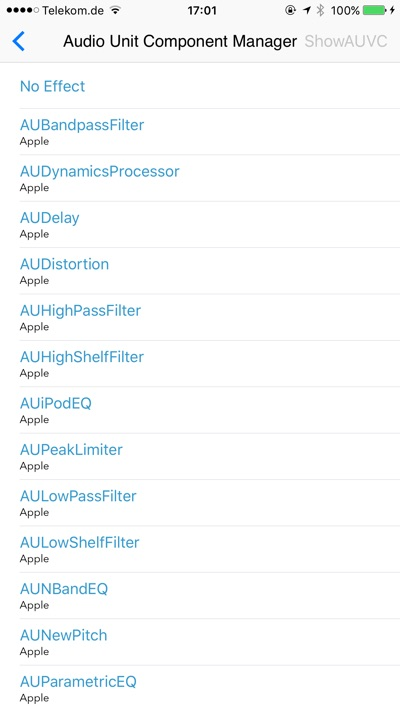

###Speech Voices

Example for new properties which are added to AVSpeechSynthesisVoice such as language, name, quality...

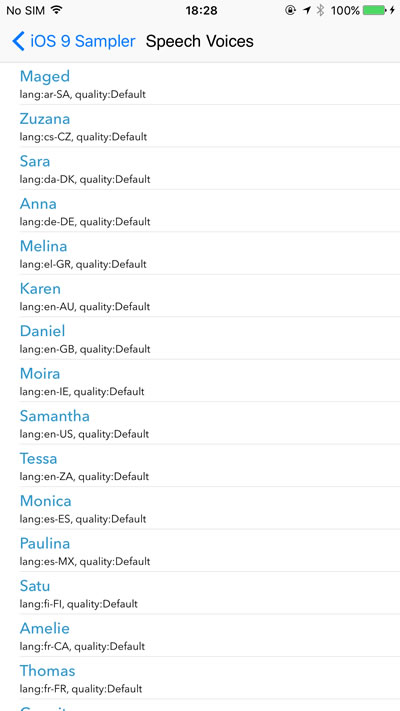

###CASpringAnimation

Animation example using CASpringAnimation.

###UIStackView

Auto Layout example using UIStackView.

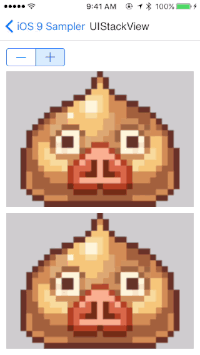

###Selfies & Screenshots

Fetch photos filtered with new subtypes `PHAssetCollectionSubtype.SmartAlbumSelfPortraits` and `PHAssetMediaSubtype.PhotoScreenshot` which are added to Photos framework.

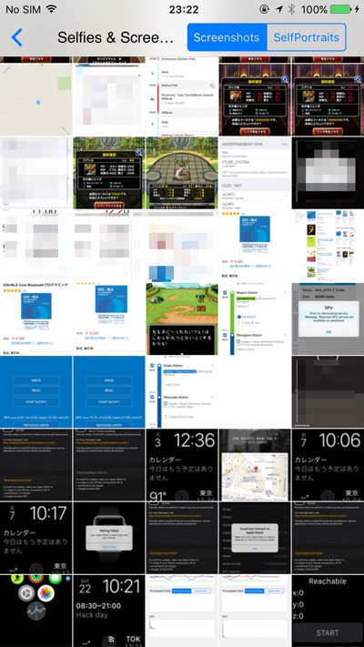

###String Transform

**String transliteration** examples using new APIs of Foundation framework.

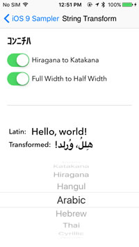

###Core Image Transitions

New transition effects which are added to `CITransitionCategory`.

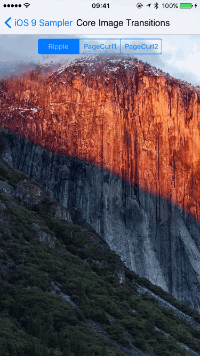

###Search APIs

Example for Search APIs using NSUserActivity and **Core Spotlight**.

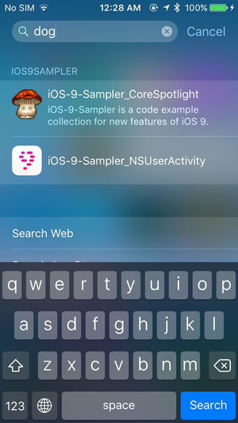

###Content Blockers

Example for Content Blocker Extensions.

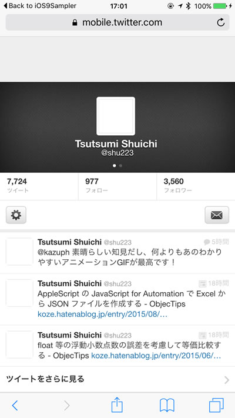

###SFSafariViewController

Open web pages with SFSafariViewController.

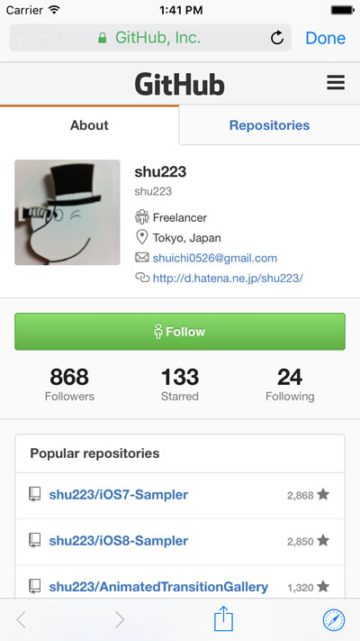

###Attributes of New Filters

Extract new filters of CIFilter using `kCIAttributeFilterAvailable_iOS`. There are **41 new filters**.

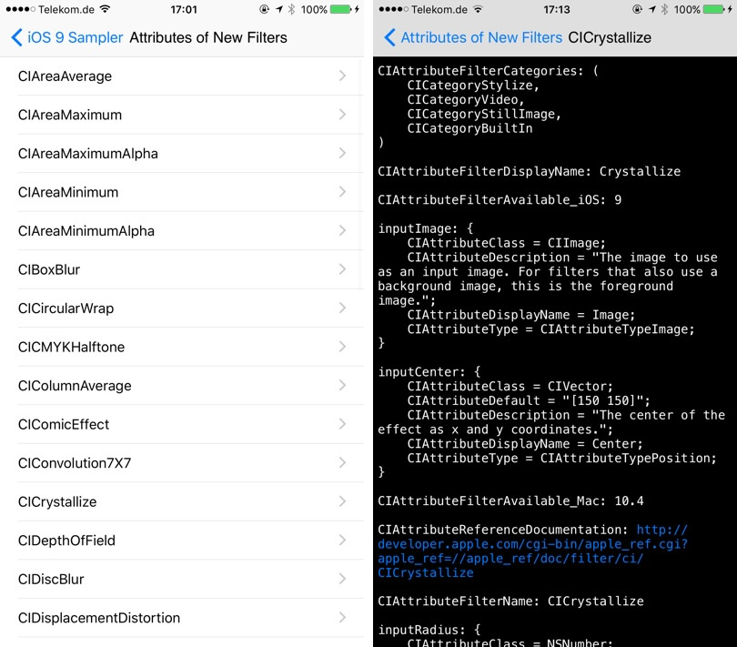

###Low Power Mode

Detect changes of "Low Power Mode" setting.

###New Fonts

Gallery of **31 new fonts**.

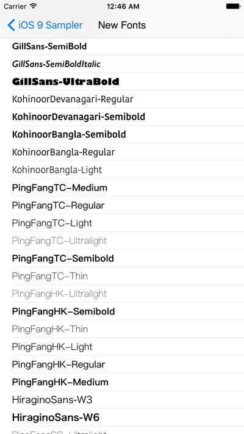

###Contacts (Created by [manhattan918](https://github.com/manhattan918))

Contacts framework sample.

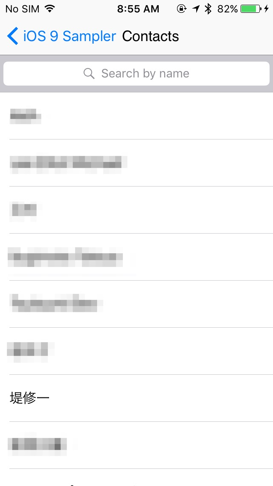

###ReplayKit (Created by [manhattan918](https://github.com/manhattan918))

ReplayKit framework sample.

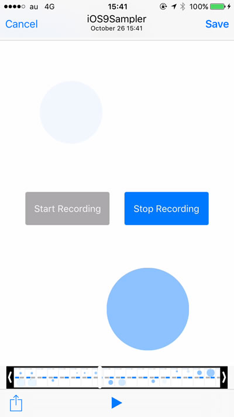

###Quick Actions (3D Touch)  

Press the Icon on Home screen deeply, so you can access to the shortcut menu.

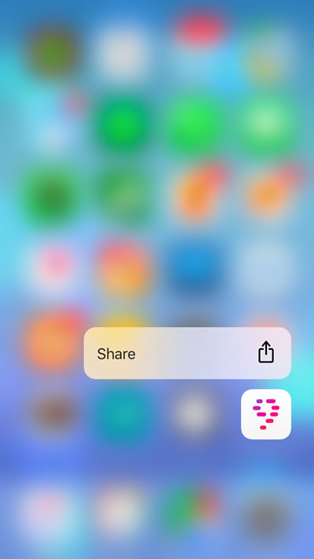

Please see `UIApplicationShortcutItems` key in Info.plist and `application:performActionForShortcutItem:completionHandler:` method in AppDelegate to know how it's implemented.

**NOTE:** Your device have to support 3D Touch.

###Force Touch (3D Touch)

Visualize the forces of touches using new properties of UITouch `force` and `maximumPossibleForce`.

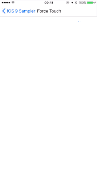

**NOTE:** Your device have to support 3D Touch.

##watchOS-2-Sampler

You can check the **examples for watchOS 2** features on [watchOS-2-Sampler](https://github.com/shu223/watchOS-2-Sampler)!!

<a href="https://github.com/shu223/watchOS-2-Sampler">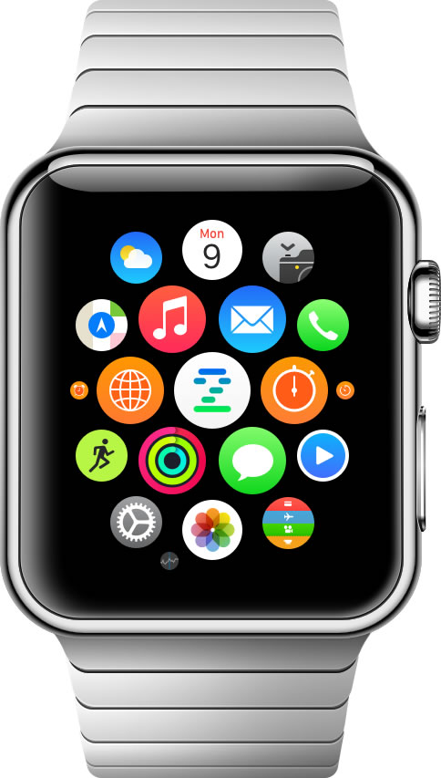</a>

 

- https://github.com/shu223/watchOS-2-Sampler

##Author

**Shuichi Tsutsumi** (Freelance iOS engineer)

- [Twitter](https://twitter.com/shu223)
- [Facebook](https://www.facebook.com/shuichi.tsutsumi)
- [LinkedIn](https://www.linkedin.com/profile/view?id=214896557)
- [Blog (Japanese)](http://d.hatena.ne.jp/shu223/)

##Special Thanks

The icon is designed by [Okazu](https://www.facebook.com/pashimo)
